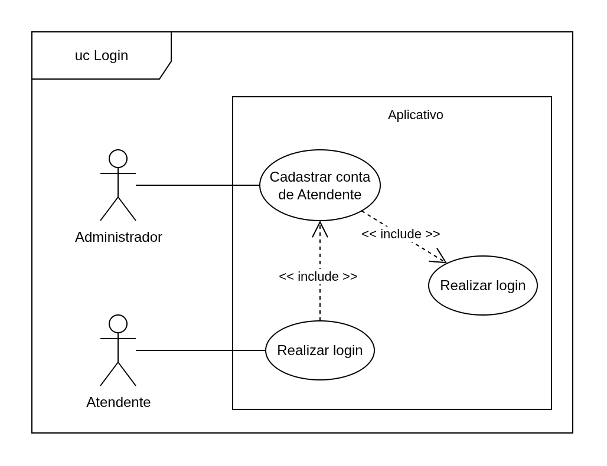
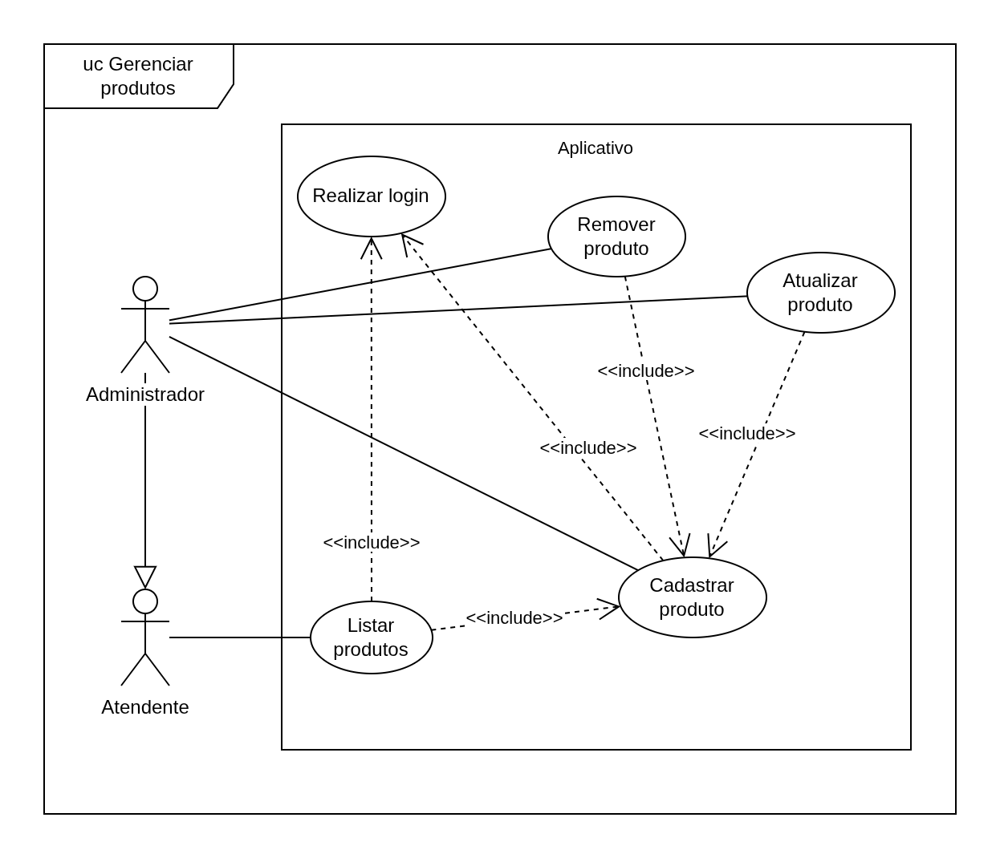
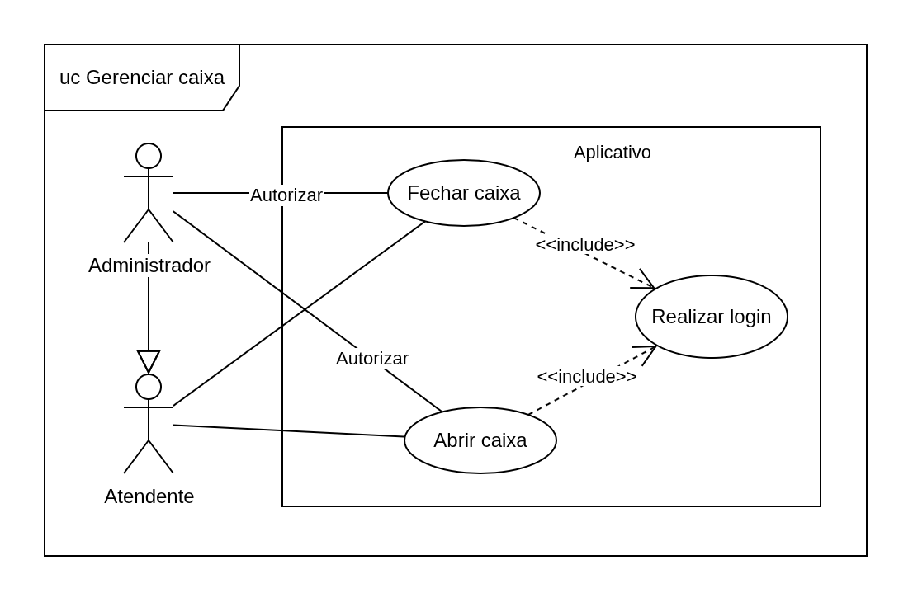
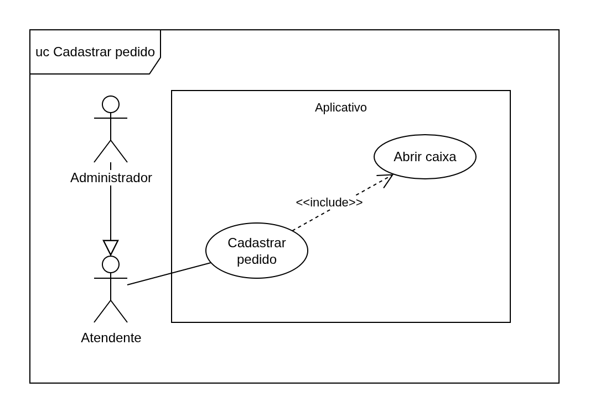
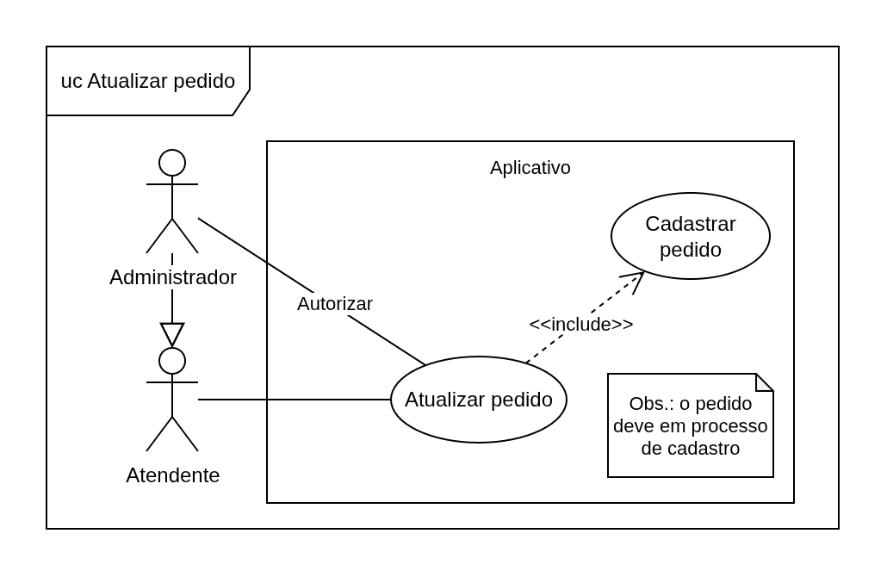

# Documento de requisitos

Lista de requisitos funcionais:

- [Login de conta de usuário](#login-de-conta-de-usuário)
- [Cadastro de conta de atendente](#cadastro-de-conta-de-atendente)
- [Cadastro de produto](#cadastro-de-produto)
- [Abertura de caixa](#abertura-de-caixa)
- [Cadastro de pedido](#cadastro-de-pedido)
- [Fechamento de caixa](#fechamento-de-caixa)
- [Listagem de produtos](#listagem-de-produtos)
- [Listagem de pedidos](#listagem-de-pedidos)
- [Atualização de produto](#atualização-de-produto)
- [Atualização de pedido](#atualização-de-pedido)
- [Remoção de produto](#remoção-de-produto)

Lista de requisitos não funcionais:

- [Conta inicial de administrador](#conta-inicial-de-administrador)

Atualizações:

| Versão | Descrição | Autores |
|:-------:| -------- | :-------: |  
| 0.1 | Adiciona resumo dos requisitos funcionais | Thiago M. Baiense |
| 0.2  | 1) Adiciona descrição dos requisitos; 2) Remove categoria de produto conforme decisão do grupo. | Thiago M. Baiense |
| 0.3  | 1) Adiciona imagens de casos de uso; 2) Adiciona link para requisitos; 3) Correção de erros | Thiago M. Baiense |

## Termos usados

A seguir, temos a definição de alguns termos usados com frequência neste documento:

- **Conta de usuário**: registro que identifica e permite que uma pessoa utilize o sistema;
- **Atendente**: conta de usuário com privilégios de atendente;
- **Administrador**: a única conta de usuário com privilégios de administrador, sendo a primeira conta registrada e fornecida junto com o sistema;
- **Pedido**: registro que representa uma compra finalizada ou não, que contém um ou mais produtos;
- **Produto**: item comercializável cadastrado no sistema;

# Requisitos funcionais

A seguir serão detalhados os requisitos funcionais.

## Login de conta de usuário

Caso de uso:

O sistema deverá permitir que o usuário acesse as demais funcionalidades somente após este inserir seu número de matrícula e a senha correspondente. O sistema deverá verificar se existe um registro com as informações fornecidas e permitir o acesso ao restante do sistema caso as credenciais sejam válidas. Caso a matrícula não seja encontrada ou a senha seja incorreta para a matrícula em questão, o sistema deverá impedir o acesso às demais funções e exibir uma mensagem de erro.

> **SUGESTÃO (THIAGO)**: O sistema deverá também verificar se há algum caixa aberto após confirmar que as credenciais são válidas. Caso haja um caixa aberto, o sistema deverá permitir o acesso somente se o caixa aberto esteja associado à conta de usuário associada às credenciais inseridas.

Dados solicitados:
- matrícula
- senha

**Resultado gerado**: permitir ou impedir o acesso ao restante do sistema com base nas credenciais.

## Cadastro de conta de Atendente

O sistema deverá permitir que um Administrador cadastre novas contas com privilégios de Atendente. Para isso, o sistema deverá gerar um código de matrícula com base no número de contas previamente cadastradas, ou seja, um código sequencial. O sistema também deverá registrar uma senha que será exatamente o código de matrícula. 

Dados gerados:
- nova conta de usuário:
  + código de matrícula
  + senha

**Resultado gerado**: sendo o cadastro bem-sucedido, o sistema deverá atualizar sua base de dados armazendo um novo registro de conta de usuário na memória secundária.

## Cadastro de produto

Caso de uso:

O sistema deverá permir que um Administrador cadastre novos produtos.

Dados solicitados:
- Nome do produto
- Preço unitário de custo
- Preco unitário de venda

**Resultado gerado**: sendo o cadastro bem-sucedido, o sistema deverá atualizar sua base de dados armazendo um novo registro de produto na memória secundária.

## Abertura de caixa

Caso de uso:

Caso não haja um caixa aberto, o sistema deverá permitir que um Atendente realize a abertura de caixa. Para concluir esta operação, será necessário inserir o código de autorização de um Administrador e que seja informado o valor em dinheiro em espécie contido no caixa no momento da abertura. 

Finalizada a abertura do caixa, o sistema deverá registrar em sua base de dados qual Atendente realizou a abertura, a data e horário da abertura, e qual o valor contido no caixa. 

Dados solicitados:
- Código de autorização de um Administrador
- Valor em dinheiro em espécie contido no caixa

**Validações necessárias**:
- se o código de autorização corresponde ao cadastrado para o Administrador;
- se o valor em dinheiro é maior ou igual a zero;

**Resultado gerado**: sendo a abertura bem-sucedida, o sistema deverá atualizar sua base de dados armazenando um registro contendo os dados do novo caixa aberto.

## Cadastro de pedido

Caso de uso:

O sistema deverá permitir que um Atendente realize a abertura de um pedido, adicionando produtos e suas repectivas quantidades. O sistema deverá exibir o valor total a ser pago pelo cliente e atualizá-lo à medida que novos itens sejam adicionados.

Uma vez que todos os itens sejam adicionados, o sistema deverá permitir que o Atendente conclua o pedido, informando o total a ser pago e solicitando qual método de pagamento será utilizado pelo cliente.

Os métodos de pagamento possíveis serão: 
- cartão
- pix 
- dinheiro

Caso o cliente opte por pagar com o cartão, o sistema deverá registrar uma taxa de 5% no pedido, mas mantendo o valor final de pagamento. 

Caso o cliente opte por pagar em dinheiro, o sistema deverá solicitar ao Atendente que informe a quantia fornecida pelo cliente e exibir o valor do troco. Se o caixa tiver uma quantia em dinheiro suficiente para o troco, o pedido deverá ser finalizado, com a quantia referente ao troco sendo descontada do valor armazenado no caixa. Na situação do caixa não possuir dinheiro suficiente, uma mensagem de erro deverá ser exibida, informando que o pedido não poderá ser finalizado utilizando o método de pagamento em dinheiro.

Dados solicitados:
- Produtos e a quantia para cada produto
- O método de pagamento
  - caso seja "dinheiro", o valor em dinheiro fornecido pelo cliente

**Validações necessárias**:
- se a quantidade dos produtos são maiores que zero
- Se o caixa possui valor suficiente para o troco, caso o pagamento seja em dinheiro

**Resultado gerado**: sendo o pedido finalizado, o sistema deverá atualizar sua base de dados armazenando um registro contendo os dados do novo pedido.

## Fechamento de caixa

Caso de uso:

Caso haja um caixa em aberto, o sistema deverá permitir que o Atendente feche o caixa, armazenando a quantia em dinheiro atual no caixa, o horário do fechamento e o valor final do caixa. Para isso, será solicitado o código de autorização do Administrador. 
Caso o código de autorização seja válido, o sistema deverá exibir o valor em dinheiro que o caixa deve ter e solicitar a confirmação para o fechamento do caixa. 

Se for confirmado o fechamento do caixa, o sistema deverá atualizar o estado do caixa para fechado e não permitir o cadastro de novos pedidos para o caixa fechado. Caso o fechamento seja cancelado, o caixa permanecerá aberto.

Entradas solicitadas:
- código de autorização do Administrador
- confirmação do fechamento

**Validações necessárias**:
- se o código de autorização corresponde ao cadastrado para o Administrador;

**Resultado gerado**: sendo o fechamento do caixa concluído, o sistema deverá atualizar sua base de dados refletindo que o caixa em questão foi fechado.

## Listagem de produtos

Caso de uso:

O sistema deverá permitir que o Atendente visualize a lista de produtos cadastrados por meio de uma funcionalidade específica e também durante o cadastro de um novo pedido. Em cada item da lista, deverão ser exibidos todas as propriedades existentes para um produto cadastrado.

## Listagem de pedidos

O sistema deverá permitir que o Atendente visualize uma listagem dos pedidos finalizados. A funcionalidade de listagem deverá permitir filtrar entre os pedidos cadastrados no caixa atual (caso haja um caixa aberto) e todos os demais pedidos já finalizados.

## Atualização de produto

Caso de uso:

O sistema deverá permitir que o Administrador altere as informações dos produtos cadastrados. O sistema deverá solicitar ao Administrador qual informação deverá ser alterada e qual será o novo valor. Para concluir a atualização, o sistema deverá exibir os valores antigos e os inseridos e solicitar a confirmação da atualização. 

Caso o Administrador confirme a ação, o sistema deverá atualizar as informações do pedido. Caso seja cancelada a ação, o sistema deverá fechar a funcionalidade de atualização, mantendo os dados do produto inalterados.  

Dados que poderão ser alterados:
- nome
- preço de custo
- preço de venda 

**Validações necessárias**:
- se os preços informados são maiores ou iguais a zero

**Resultado gerado**: sendo a atualização efetuada, o sistema deverá atualizar sua base de dados atualizando o registro do produto.

## Atualização de pedido

Caso de uso:

Durante o cadastro de um pedido, o sistema deverá permitir que o Atendente remova e altere a quantidade dos produtos inseridos no pedido e também que o Atendente cancele o pedido. Para finalizar a atualização o sistema deverá solicitar o código de autorização do Administrador. 

Dados solicitados:
- se aplicável, nova quantidade para um produto
- se aplicável, qual produto deve ser removido
- o código de autorização do Administrador

**Validações necessárias**:
- se o código de autorização corresponde ao cadastrado para o Administrador;
- caso aplicável, se a nova quantidade para um produto é maior que zero

**Resultado gerado**: sendo a atualização concluída, o sistema deverá atualizar o pedido e recalcular o valor total a ser pago.

## Remoção de produto

Caso de uso:

O sistema deverá permitir que o Administrador remova um produto do catálogo. Antes de finalizar a remoção, o sistema deverá solicitar a confirmação da ação.

Caso o Administrado confirme a ação, o sistema deverá remover o produto em questão. Caso ele cancele a ação, o produto deverá ser mantido.

Dados solicitados:
- qual produto será removido
- a confirmação da remoção

**Resultado gerado**: sendo a ação confirmada, o sistema deverá atualizar sua base de dados removendo o registro de produto em questão.

# Requisitos não funcionais

## Conta inicial de administrador

O sistema deverá possuir uma conta de Administrador cadastrada com dados fixos, que será utilizada para cadastrar os demais Atendentes. 

Seus dados serão: 
- número de matrícula
- código de autorização 
- senha de login

Na primeira vez que o sistema for inicializado, deverá ser exibida as credenciais associadas ao Administrador.
